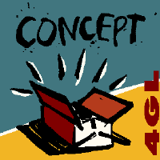

# uq-concept README

Unique AS was an independent software provider from Stavanger, Rogaland Norway.
The company created the Concept 4GL programming language and a portable runtime 
that supported applications developed in Concept.

## Features

Basic syntax highlighting for Concept 

## Requirements

Concept installation

## Extension Settings

Include if your extension adds any VS Code settings through the `contributes.configuration` extension point.

For example:

This extension contributes the following settings:

* `myExtension.enable`: Enable/disable this extension.
* `myExtension.thing`: Set to `blah` to do something.

## Known Issues

None so far.

## Release Notes

Initial release. Just basic syntax.
Next features:
- development container integration
- language documentation

### 0.0.1

Initial release.